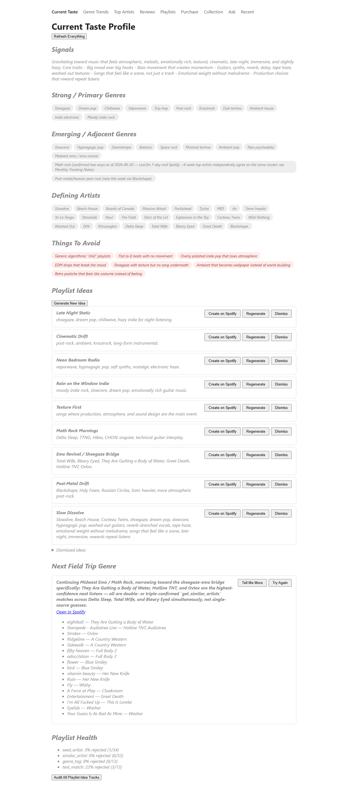
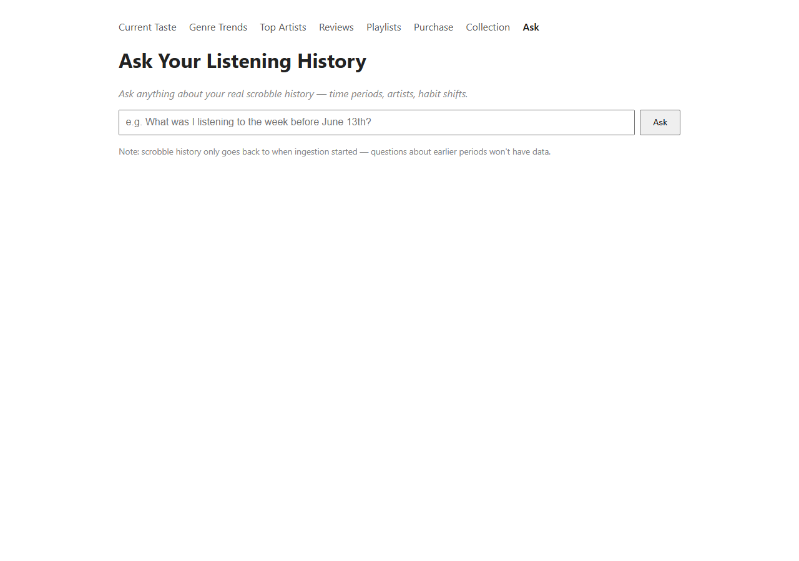
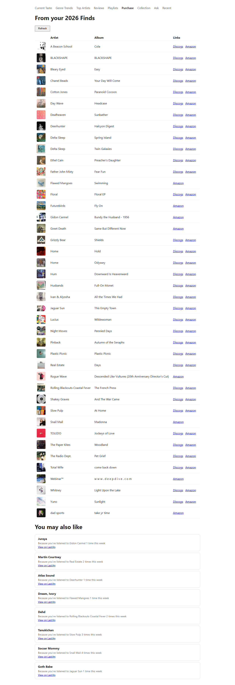
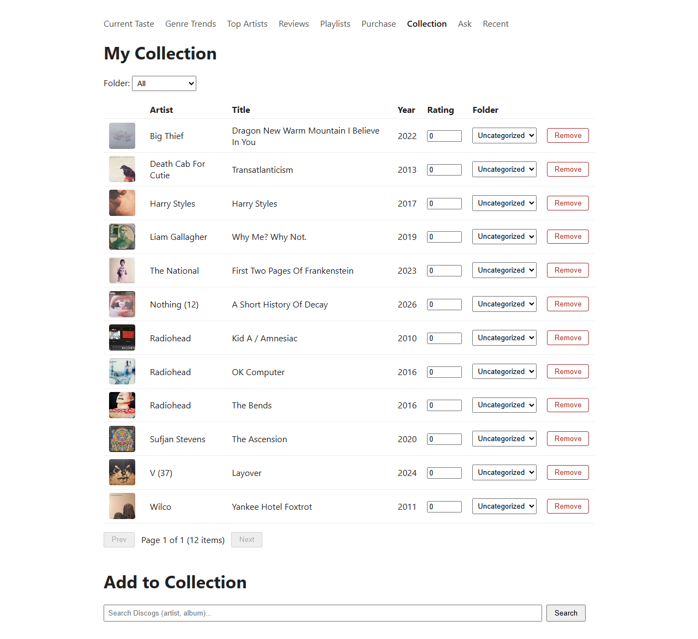
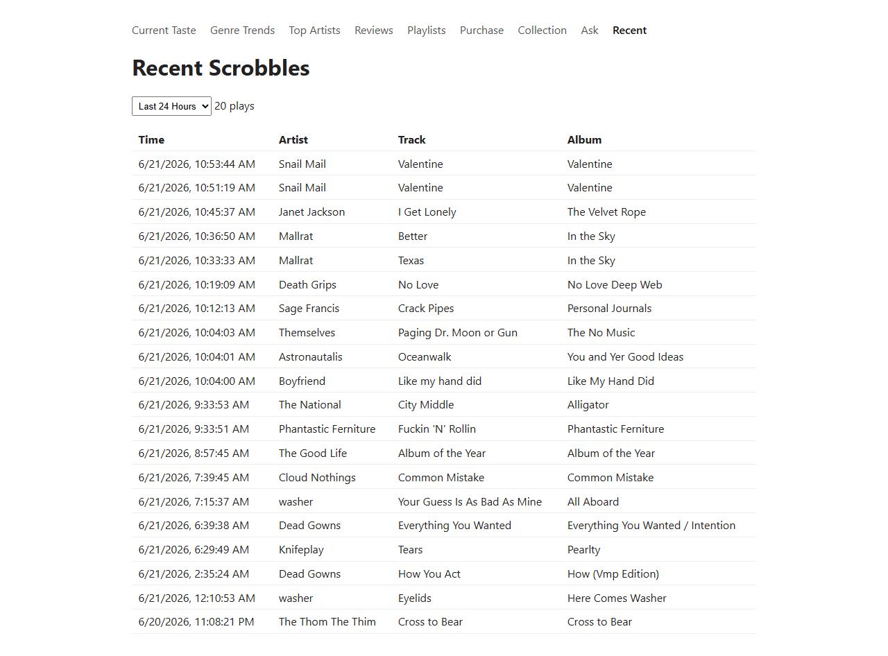

# MusicDash

### Your music taste, finally paying attention to itself.

---

## The problem

You listen to a *lot* of music — across Spotify, Last.fm, and a growing vinyl collection on Discogs. But none of those apps talk to each other, none of them really understand your taste over time, and none of them can answer a simple question like *"what have I actually been into this month, and why?"*

Spotify's recommendations are a black box. Last.fm just logs plays without doing anything with them. Discogs knows what you own, but has no idea what you actually listen to. And manually exporting CSVs and pasting them into ChatGPT every week to get a taste report? That gets old fast.

## What MusicDash actually is

MusicDash is a personal dashboard that pulls all of that scattered data into one place — and then adds something none of those apps have: a real AI co-pilot that actively studies your listening, builds a living model of your taste, and helps you act on it. Not a generic "you might also like" algorithm. Something that actually knows you.

Think of it as a music taste command center: one tab tells you who you are musically *right now*, another lets you ask it anything about your listening history in plain English, another turns a vague "you should check out this genre" note into a real, ready-to-play Spotify playlist — built, reviewed by a second independent AI, and one click away.

## Why it exists

This started as a way to replace a tedious manual ritual (export → upload → paste into ChatGPT → wait) with something that runs live, instantly, and gets smarter the more it's used. It's grown into a full system that doesn't just *report* on your taste — it acts on it.

## The features

**🎯 Current Taste Profile**
A living snapshot of your musical identity — strong genres, emerging genres you're drifting toward, the artists that define your current sound, and things to actively avoid. Updated by an AI reviewer that studies your actual listening data, not guesswork.

**💡 Playlist Ideas, on tap**
Fresh playlist concepts generated from your real taste profile — each one a single click away from becoming an actual Spotify playlist, fully populated with real tracks. Don't like one? Dismiss it. Want a different crop of songs for the same idea? Regenerate it. Want a brand new idea you haven't seen yet? Just ask for one.

**🛡️ A second opinion, built in**
Every playlist gets reviewed by an *independent* AI model before you trust it — a genuine second opinion that double-checks the work, flags anything questionable with a real explanation, and lets you decide whether to act on it. Quality control that two AIs agree on, not one AI's unchecked guess.

**🧭 "Next Field Trip Genre" — with actual substance**
The system doesn't just suggest a genre to explore next — it teaches you about it. A real history pulled from research, the artists that define it, what it actually sounds like, and a button that instantly builds you a real playlist to go explore it. Run it again any time for a totally fresh batch of tracks.

**💬 Ask anything**
A genuine conversation with your own listening history. "What was I obsessed with the week before I started seeing her?" "How has my listening changed in the last month?" Ask in plain English, get a real, specific answer pulled from your actual data — not a guess.

**🛍️ From streaming to shelf**
See which albums you've been loving on Spotify and instantly check what's available to buy on vinyl — with smart recommendations for what to buy next, based on what you're actually playing, not generic bestseller lists.

**📀 Your collection, live**
A direct window into your real Discogs collection — browse, rate, organize, and add to it right from the dashboard, no tab-switching required.

**📰 Live scrobble feed**
See exactly what you've listened to today, this week, this month — in a clean, simple list. No digging through Last.fm's interface.

**📈 Genre trends over time**
Watch your taste actually evolve — which genres are growing, which are fading, charted out so the shift is visible instead of just felt.

**🔍 The daily pulse check**
Beyond the big weekly taste reports, a lightweight check-in that catches *behavior* changes as they happen — binge patterns, brand-new artists before they'd otherwise be noticed, shifts in when and how you're listening. Built for daily or even hour-to-hour curiosity, not just a once-a-week ritual.

## The bottom line

MusicDash turns "I listen to a lot of music" into "I actually understand my own taste, and I have a tool that helps me act on it" — discovering new music, building the playlists you actually want, and slowly turning your streaming habits into a real, physical collection.

It's not a Spotify wrapped-style end-of-year summary. It's a living, daily, *useful* relationship with your own music taste.
